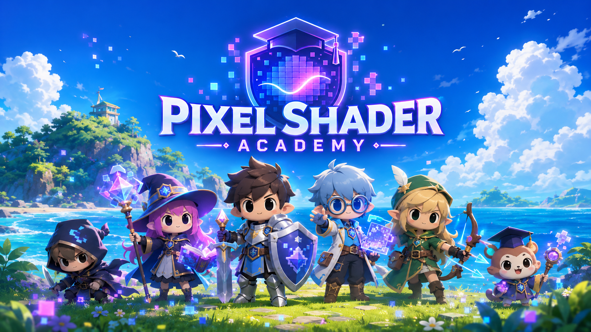

# Pixel Shader Academy

> 비디오 게임처럼 GLSL을 배우세요.

[**🎮 무료 데모 플레이 →**](https://shader.dolstep.com) &nbsp;·&nbsp; [🌐 홍보 사이트](https://bobddadoo.github.io/pixel-shader-academy/) &nbsp;·&nbsp; 🛒 **itch.io 출시 예정**

[English README](./README.md)

---

## 이게 뭐예요?

**Pixel Shader Academy** 는 브라우저에서 단계별로 풀어가는 GLSL 프래그먼트 셰이더 플레이그라운드입니다.
오른쪽에 코드를 쓰고, 위쪽에서 실시간 프리뷰를 보고, 왼쪽에서 레슨을 읽고, **Run** (또는 `Ctrl+Enter`) 으로 실행하세요. **Check** 버튼을 누르면 정답 셰이더와 자동으로 비교 채점됩니다.

설치 필요 없음. 툴체인 필요 없음. Node 도, Unity 도 필요 없습니다. 탭 하나만 열면 바로 셰이더를 쓸 수 있어요.

> 이 저장소는 프로젝트의 **공개 홍보 페이지** 입니다.
> 게임 본체는 별도 private 저장소에서 개발하며, itch.io 에서 판매할 예정입니다.

---

## 왜 해야 해요?

- **데모 모음이 아니라 진짜 커리큘럼.** 모든 스테이지에 직접 쓴 한국어/영어 레슨 페이지가 붙어 있어요. 개념, 관련 GLSL 함수, 그리고 힌트 위주의 도전 과제.
- **버튼 하나로 자동 채점.** Check 버튼이 여러 시점에서 사용자 셰이더와 정답 셰이더를 렌더링한 뒤 채널별 픽셀 차이를 계산해서 통과 여부를 판정합니다. 허용 오차는 넉넉해서 단일 픽셀 반올림으로 떨어지는 일은 없어요.
- **즉각적인 피드백.** CodeMirror 6 에디터, Three.js 풀스크린 쿼드, `Ctrl+Enter` 컴파일. GLSL 에러 로그는 `ERROR: 0:42` 가 아니라 실제 줄 번호를 가진 친절한 형태로 돌려줍니다.
- **텍스처 지원.** 이미지를 업로드해서 정사각형으로 크롭한 다음, 스테이지 6 부터 `u_texture` 로 샘플링할 수 있어요.
- **라이트/다크 테마.** 낮에는 시원한 회색 라이트 팔레트, 밤에는 깊은 보라 다크 모드.

---

## 지금 들어있는 것

스테이지 12개가 공개돼 있고, 9개 카테고리 × 총 100스테이지를 목표로 확장 중입니다:

| # | 제목 | 개념 |
|---|---|---|
| 1 | UV Gradient | `gl_FragCoord` → uv |
| 2 | Time-Based Blink | `u_time`, `mod`, `step` |
| 3 | Remap Sin to 0..1 | affine remap |
| 4 | Circle Mask | 거리장 |
| 5 | Circle Outline | `smoothstep` AA |
| 6 | Sample a Texture | `texture2D`, `u_texture` |
| 7 | Dissolve Effect | 해시 노이즈 + 임계값 |
| 8 | Hit Flash | 채널 단위 효과 |
| 9 | Pixelation | `floor(uv * N) / N` |
| 10 | Wave Distortion | UV 왜곡 vs 결과 왜곡 |
| 11 | Combine Everything | 합성 전략 |
| 12 | Cosine-Palette Kaleidoscope | IQ 스타일 팔레트 + fract 반복 |

신스웨이브 도시, 불 셰이더, 레이마칭 씬, 스프라이트 아틀라스 등이 작업 중입니다.

---

## 어디서 해요?

- **무료 데모 (항상 최신):** [shader.dolstep.com](https://shader.dolstep.com)
- **itch.io 정식 출시:** *준비 중 — 위시리스트 링크가 열리면 [shader.dolstep.com](https://shader.dolstep.com) 에서 안내합니다.*

---

## 라이선스 / 상태

게임의 **소스 코드** 는 private 저장소에서 개발되고 itch.io 에서 상용 제품으로 판매됩니다.
이 저장소에 있는 건 **공개 홍보 페이지** (랜딩 사이트 + 배너 아트 + README) 이고, 그 컨텐츠에 한해 MIT 라이선스입니다.
